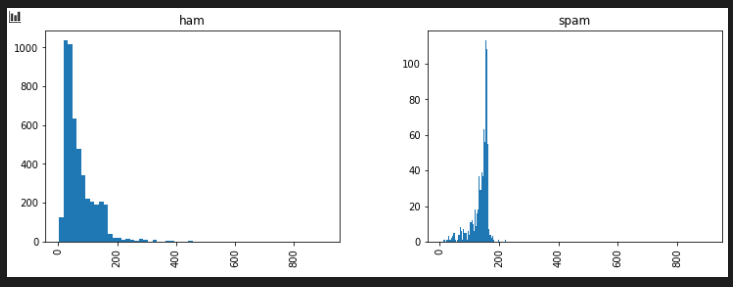
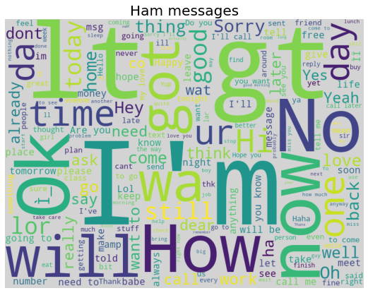
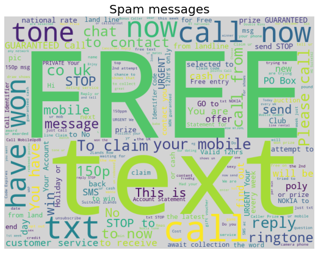
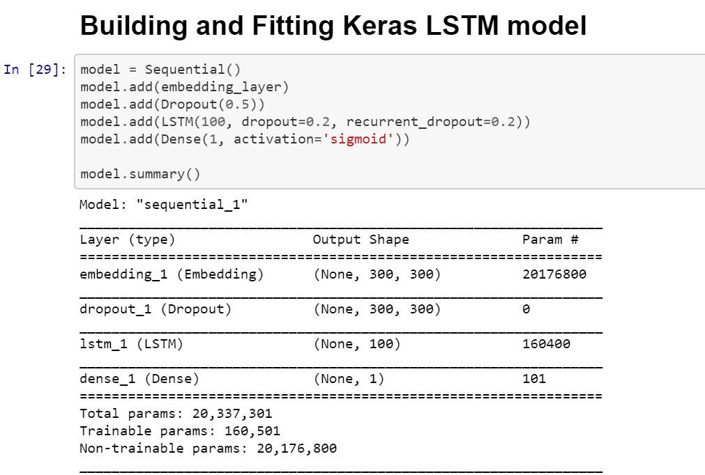
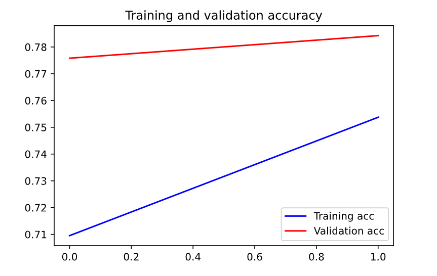
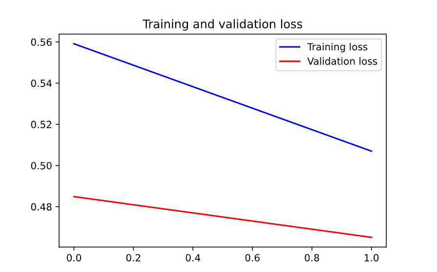
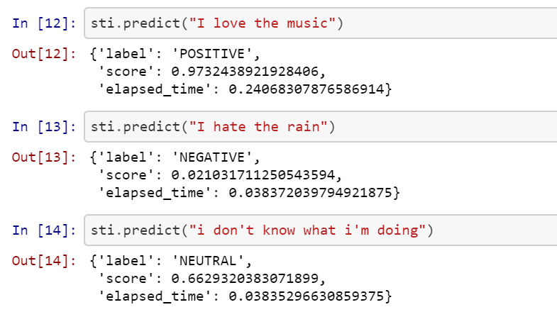
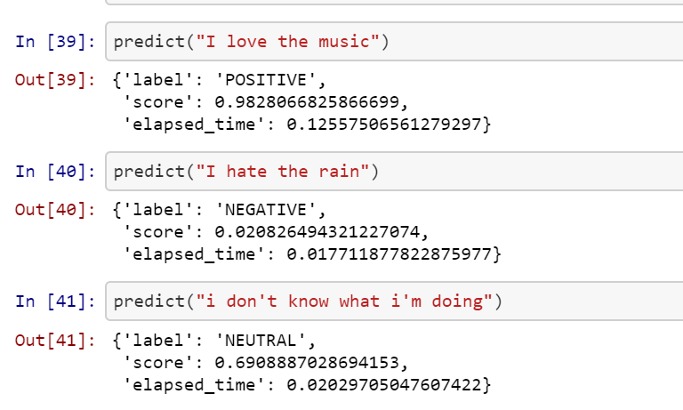

# CSDA1040: Advanced Methods of Data Analysis

## Lab 2 - Text Mining and Deep Learning in ML/AL

### SMS Spam Identifier and Twitter Sentiment Detection

Submitted By Group 8

Michaela Hrabetova (ID: 217590209)

Lu Han (ID: 217618638)

Tony Chan (ID: 217635038)

Cristina Endara (ID: 217625567)

Sangeeta Khanna (ID: 217638719)

**Date of Submission:** June 8, 2020

---

## GIT

- We share work on github.com. Link is [here](https://github.com/todatech/csda-lab.git)

## SMS SPAM IDENTIFIER USING TEXT MINING TECHNIQUES

## Introduction

Over the past two decades SMS spam has grown significantly. Canada's Spam Reporting Centre receives approximately 5,000 spam complaints per week. Some are connected to legitimate commercial messages from various companies and others are related to scams, fraud and privacy threats, hence the increasing importance of mechanisms to identify such type of messages.

The first part of this project includes a Spam Identifier Engine from an SMS dataset. We relied on text mining techiques to clean up and vectorize the text messages in the dataset. We used a typical scikit-learn preprocessing package to vectorize the text messages into TF-IDF matrix. We evaluated various classification algorithms and determined that linearSVC was more suitable for this particular dataset in terms of performance and accuracy.

## Description of Dataset and Data Exploration

We used the SMS Spam Collection Dataset obtained from [Kaggle](https://www.kaggle.com/dejavu23/sms-spam-or-ham-beginner/notebook). It contains data for 5,000 spam and not spam SMS messages classified as SPAM or HAM accordingly.

Since ~75% of the messages are HAM (not spam), the model might skew more towards the not spam side. Also, most of the SPAM messages tend to have a higher number of words (towards the 160 maximum words in SMS) versus the HAM messages where the majority have less than 100 words.

## Text Mining

We applied python's Natural Language Toolkit NLTK to remove punctuation and stopwords. Both are common tokens in the language and by removing them we expect to increase the classification models accuracy.

| Label | Text | Spam | length| filtered_text
| --- | --- | --- | --- | --- |
| ham | Go until jurong point, crazy.. Available only ... | 0 | 111 | [go, jurong, point, crazy, available, bugis, n...
| ham | Ok lar... Joking wif u oni... | 0 | 29 | [ok, lar, joking, wif, u, oni]
| spam | Free entry in 2 a wkly comp to win FA Cup fina... | 1 | 155 | [free, entry, 2, wkly, comp, win, fa, cup, fin...
| ham | U dun say so early hor... U c already then say... | 0 | 49 | [u, dun, say, early, hor, u, c, already, say]
| ham | Nah I don't think he goes to usf, he lives aro... | 0 | 61 | [nah, dont, think, goes, usf, lives, around, t...

A typical wordcloud show us that many SPAM messages include words related to prizes, free goods/services and requiring the receiver to take an action (i.e. call or do something urgent). Here are some main characteristics of the two types of messages where some of the most frequent words are:

    SPAM: free, text, tone, now, call, won, to claim your mobile.

    HAM: I'm, how, will, no, now, ok, now

## Feature extraction

We used scikit-learn's feature extraction module for pre-processing and to transform the text data into a format that can be used by the machine learning algorithms. Specifically, the TfidfVectorizer was applied for generating a vectorized matrix model. TF-IDF allows us a more effective identification as it gives a higher weight to frequent terms that are not so frequent in the whole dataset.

The vectorized matrix of the SMS dataset contains approximately 9,000 vectors.

We have also run a few data visualization on this dataset. Here is Text Lenght versus the number of ham/spam occurences chart.

We've also generated a word cloud to visualize the words that are often found in a typical "ham" and "spam" message.

These are some of the words typically found in valid messages.

These are some of the words typically found in spam messages.

## Train Test Split

We performed a Train Test Split (75%/25%) to train and verify our models based on this particular dataset.

Below is an example of the Train set.

|  | tfidf |
| --- | --- |
| onit | 0.568280 |
| small | 0.469408 |
| house | 0.402249 |
| work | 0.335512 |
| going | 0.303086 |
| ... | ... |
| end | 0.000000 |
| enc | 0.000000 |
| enamous | 0.000000 |
| en | 0.000000 |
| ûówell | 0.000000 |

Below is an example of the Test set.

|  | tfidf |
| --- | --- |
| april | 0.644528 |
| bday | 0.545374 |
| real | 0.535865 |
| 008704050406 | 0.000000 |
| peril | 0.000000 |
| ... | ... |
| ending | 0.000000 |
| ended | 0.000000 |
| end | 0.000000 |
| enc | 0.000000 |
| ûówell | 0.000000 |

## Machine Learning Model - Choosing the Right Estimator

In order to build a machine learning model for this dataset, we run several classification models recommended for labaled data with less than 100,000 samples. Models suggested by [scikit-learn cheat sheet](https://scikit-learn.org/stable/tutorial/machine_learning_map/index.html).

We selected linearSVC estimator for our Spam Identifier Engine because it resulted in better accuracy (0.985) and only takes few milliseconds to compute, while some of the other models take up as much as a minute to compute. We used this model for our Dash App implementation of this particular set of data. Results below:

1. SVC

        SVC Accuracy:  0.9842067480258435
        CPU times: user 1.12 s, sys: 19.3 ms, total: 1.14 s
        Wall time: 1.15 s

2. LinearSVC

        Linear SVC Accuracy:  0.9849246231155779
        CPU times: user 6.44 ms, sys: 408 µs, total: 6.85 ms
        Wall time: 6.53 ms

3. Naive Bayes

        Naive Bayes Accuracy:  0.9669777458722182
        CPU times: user 2.43 ms, sys: 829 µs, total: 3.25 ms
        Wall time: 2.62 ms

4. KNeighbors Classifier

        KNN Accuracy:  0.9188801148600143
        CPU times: user 101 ms, sys: 22 ms, total: 123 ms
        Wall time: 123 ms

## SENTIMENT ANALYSIS USING DEEP LEARNING METHODS

For deep learning part of the exercise, we selected the twitter sentiment dataset for this demonstration. This dataset can be found [here](http://help.sentiment140.com/for-students/).

We went through the same process as lab2a. We carried out data preprocessing, feature extraction, and modeling for this second part of the lab. Instead of using the "traditional" scikit-learn library, we followed the example from [Paolo Ripamonti](https://www.kaggle.com/paoloripamonti) and built a sentiment engine using Gensim/Keras.

Gensim is a Topic Modeling Engine for processing text and for word vector generation. Keras, on the other hand, is a wrapper for the underlying tensorflow neural network engine. In Paolo's example, he used LSTM as the underlying neural networking model for sentiment detection. We borrowed his example and implemented a python engine for our dash app. However, for our application, we tuned down the model by tweaking down some of the parameters, as well as downsizing the dataset in order to minimize the model generation time from 8+ hours down to 10 mins. Nonetheless, this model still give a respectable 0.78 accuracy even though we slashed the model heavily.

### Introduction for Sentiment Analysis

This module contains library of Sentiment Analyzing Class. When the engine is up and running, it is able to detect sentiment within a text string, whether it is a POSITIVE mesage, NEGATIVE, or NEUTRAL.

[Lab 2b Sentiment Analyzing Engine Class](https://github.com/todatech/csda-lab/blob/master/lab2/sentiment.py)

[Lab 2b Sentiment Analyzing Engine Class Test Notebook](https://github.com/todatech/csda-lab/blob/master/lab2/sentiment_class_test.ipynb)

This engine can help us identify the sentiment of the sentence. It can also give us some examples of the positive or negative examples.

### Description of Twitter Sentiment Dataset
[Part1 - Twitter sentiment data explore](https://github.com/todatech/csda-lab/blob/master/lab2/twitter_sentiment_data_explore.ipynb)

Our Work is based on "Another Twitter sentiment analysis with Python" by Ricky Kim on towardsdatascience.com

There are heavy modifications to the original work for code enhancements, encapsulation, improvement, bug fixing in order to make the original source work for this project. Eventually, a realization of deep learning model within a python class called SentimentInferencing. Python source can be found in [sentiment.py](https://github.com/todatech/csda-lab/blob/master/lab2/sentiment.py)

## Keras Neural Network and Long Short Term Memory (LSTM)
[Part 2 - Deep Learning Model: Twitter Sentiment Analysis - Neural Network Modeling LSTM | Keras](https://github.com/todatech/csda-lab/blob/master/lab2/twitter_sentiment_lstm.ipynb)

The model accuracy results:

 ACCURACY: 0.7781000137329102
 LOSS: 0.4706464828491211
 CPU times: user 1min 22s, sys: 5.98 s, total: 1min 28s
 Wall time: 20.7 s

## Conclusion for Lab 2 Text Mining and Deep Learning

