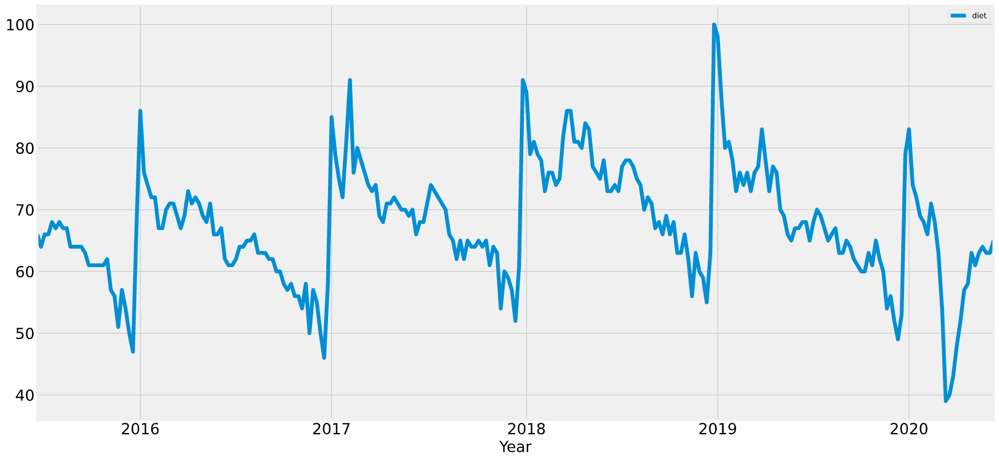
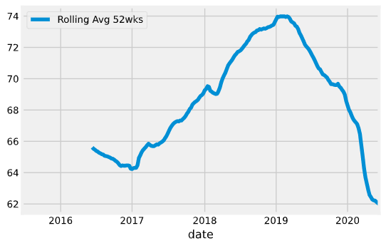
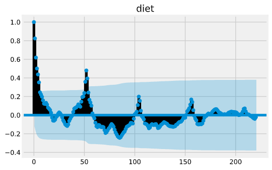
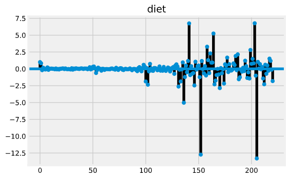
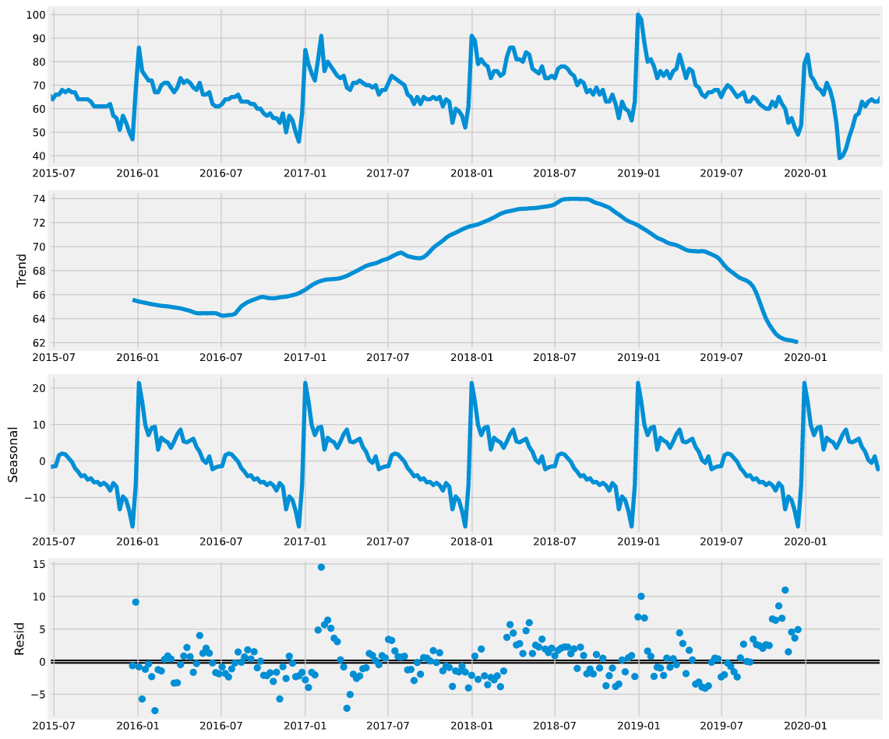
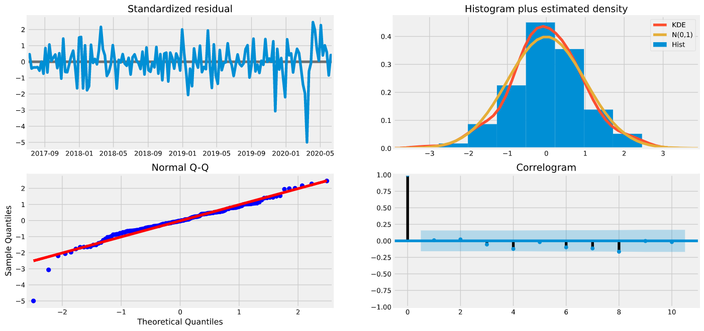
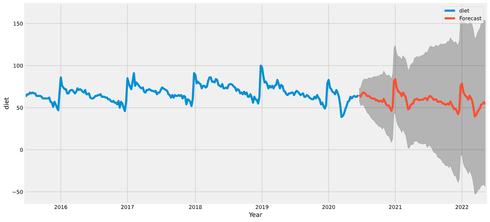

# CSDA1040: Advanced Methods of Data Analysis

## Lab 3 - Time Series Analysis

### Disecting Time Characteristics in a Google Search Term | SARIMA modeling

Submitted By Group 8

Michaela Hrabetova (ID: 217590209)

Lu Han (ID: 217618638)

Tony Chan (ID: 217635038)

Cristina Endara (ID: 217625567)

Sangeeta Khanna (ID: 217638719)

**Date of Submission:** June 22, 2020

---

## GIT

- We share work on github.com. Link is [here](https://github.com/todatech/csda-lab.git)

## Introduction

This project aims to learn more about the time characteristics of a search term of interest. When users enter a search term on Google, the servers record the time of the search. Over the years Google has collected an enormous amount of search data. Through the use of Google's own utility called [Google Trends](https://trends.google.com/trends/?geo=US), we are able to view users' interest over time for any search term. In addition to time, Google Trend is able to provide the different geographical locations worldwide of where these searches were originated.

By leveraging this data and using SARIMA modelling for time series, we aim to learn about the time characteristics of any given search term. We will break it down into different time components and further predict the search frequency over the next year or so.

Applying regression on the time-series dataset for any given keyword is fairly easy as it involves using the SARIMA algorithm in a few lines of code. However, choosing the right P, d, Q parameters in SARIMA/ARIMA(P, d, Q) requires tweaking and human trial and error. Since every keyword has very different time characteristics, (for example 'diet' and 'covid' exhibit totally different time-varying behavior), we need a more robust way to tweak those numbers. This is out of the scope of this project.

## Data Preprocessing for Google Trends Keyword Search

Data has been obtained through the use of pytrends package, which connects to Google Trends API web services. Pytrends allows different ways to pull data from the web services. For this project's purpose, we limited the scope to the "default settings", that is letting the API to provide us with the default region and time frame: North America region and the 5 most recent years of data.

Data is determined to be in a very clean state. The only data cleaning work required was to properly realign the data and to drop some columns that are not needed. The API provide us with weekly data points, which we think it is a good compromise between visibility and computalion time.

We further dig into how we should approach dissecting information from the time series. Since most search terms have seasonal effects in it, we will focus on the trends and seasonality. We believe that most terms do not have much noise associated with them, unlike the stock market time-series data where there are a lot of external factors affecting prices on daily basis. We do not expect searches to have this kind of external behaviors that give rise to noise. We took this in consideration when modelling p, d, q parameters of ARIMA and SARIMA.

Most terms we tried have a trend associated with them. Depending on whether it is a news topic i.e. "Covid-19" or "diet" or "Justin Bieber", we see very different trending lines associated. Since the data points are on weekly basis, we used a window of 52 weeks - time period of a year - to see if there there are any upward or downward trends. For example, for the word "diet", there are more searches at the beginning of the year, most likely in line with New Year's resolutions and in prepation for summer vacations (see graph below).

"Diet" search trend.

Using a 52-week rolling average, we also see a gradual increase from 2017 to 2019 and a significant decline after 2019.

"Diet" 52-week rolling average.

When we looked at autocorrelation and partial autocorrelation, most search terms exhibit certain repeating pattern in autocorrelation (measures how much a series is correlated with itself at different lags) but not much apparent patterns in partial autocorrelation (can be interpreted as a regression of the series against its past lags).

For example, for the word "diet", we see there is autocorrelation in every 52 weeks (see graphs below).

"Diet" autocorrelation.

"Diet" partial autocorrelation.

Using Statsmodels package, the seasonal decomposition graph below allows to see further patterns of the "diet" time series.

"Diet" seasonal decomposition.

## Data Modeling using SARIMA

ARIMA consists of 3 models combined into one. AR (autoregressive), I (integrate), MA (Moving-Average) and we can selectively use any or all models at once using parameters specified to ARIMA(P, d, Q).

SARIMA has a seasonal part that breaks up ARIMA further into two components (Trends, Seasonal). In our juypter notebook, we have run a few sample keywords with SARIMA and it turn out good result. Furthermore, we fed this to a grid search and try to locate combinations of SARIMA parameters (6 in total). We settled with one set of parameters for all cases of all keywords (see graphs below). This is also one of the limitation for this app, because we cannot optimize these parameters on the fly for individual keywords. It took about 30 mins to find an optimal parameters in grid search, and thus it is not ideal for web app where users wish to have a quick response.

"Diet" SARIMA Model.

"Diet" SARIMA Time-Series Forecast.

